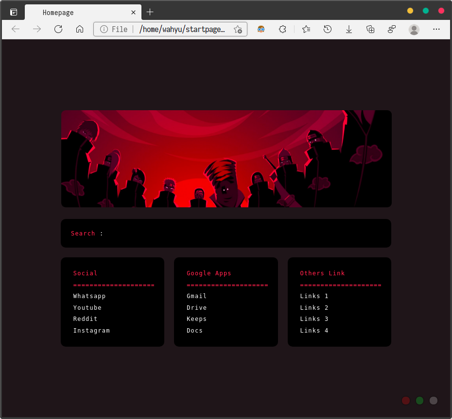
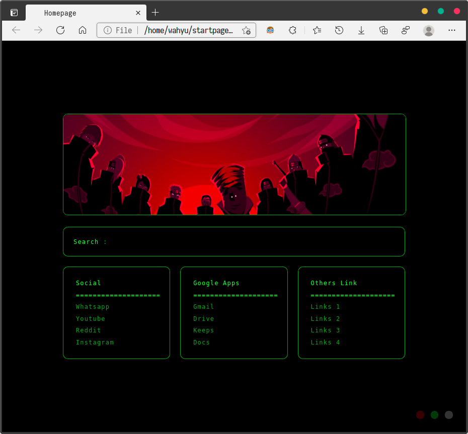
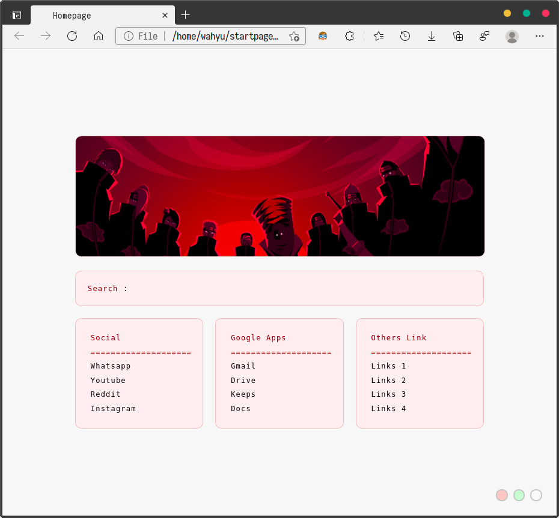

# Start-Page
I just edit a startpage with my custom theme.

Origginal startpage of Jarvvski [https://github.com/Jarvvski/Start-Page](https://github.com/Jarvvski/Start-Page).

# Changes
1. New Themes and look
2. add banner image

# Usage
1. Edit the HTML file and add your own custom links
2. Change colours in the different CSS files

Check [/r/startpages](https://www.reddit.com/r/startpages/) to find out how to use it with your specific browser.

# Screenshots

1. Theme Default

2. Theme Hacker

3. Theme Light
